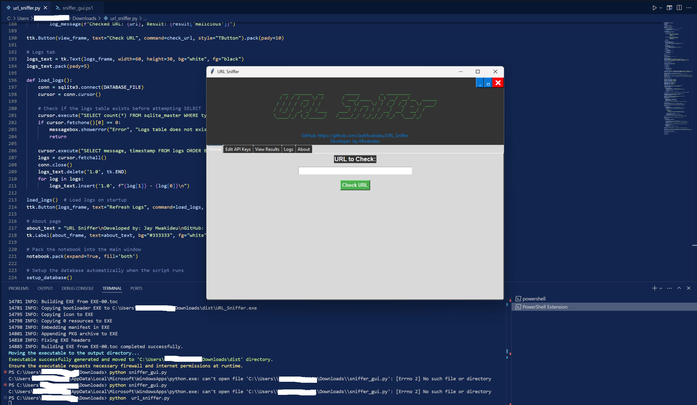
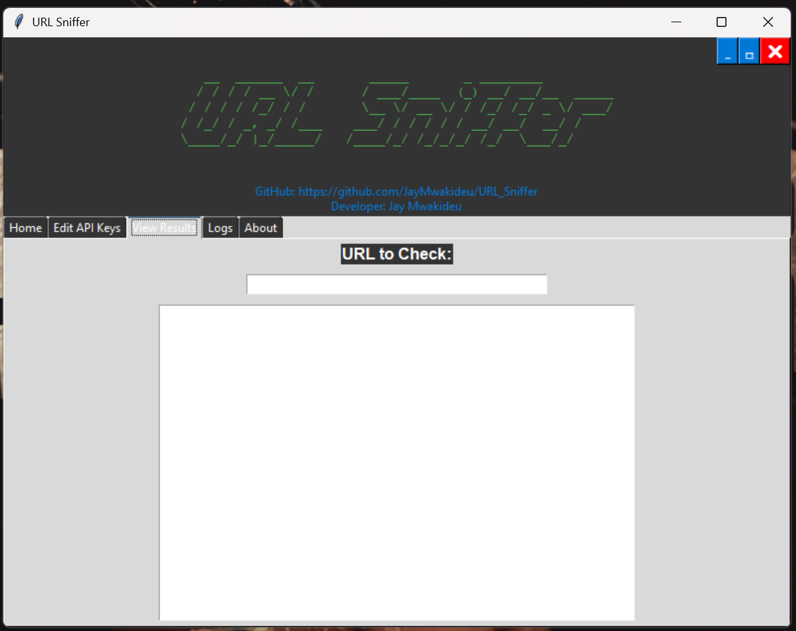

# URL Sniffer



## Overview
**URL Sniffer** is a robust application designed to check whether URLs are potentially malicious by leveraging external API services. It's crafted for security enthusiasts, web developers, or anyone concerned about URL safety to validate and analyze URLs for malicious content.

> **⚠️ Disclaimer:** Use this tool responsibly. Ensure you have permission to scan URLs, and never use it for malicious purposes.

---

## Key Features
- **URL Validation**: Checks if a URL is properly formatted before proceeding with analysis.
- **Malicious URL Detection**: Integrates with **VirusTotal** and **IPQualityScore** APIs to flag potentially harmful URLs.
- **User-Friendly Interface**: Features a GUI for easy navigation through different functionalities like URL checking, API key management, and log viewing.
- **Database Integration**: Stores checks, results, and logs in a **SQLite** database for review and analysis.
- **API Key Management**: Securely manage and store API keys locally.

---

## System Requirements
To use **URL Sniffer**, ensure you have:
- **Python 3** installed (3.8 or above recommended).
- Required dependencies (listed in `requirements.txt`).

Install the necessary libraries using:

pip install -r requirements.txt


## Installation Guide

Clone this repository:


git clone https://github.com/JayMwakideu/URL_Sniffer.git
cd URL_Sniffer
Install the dependencies:


pip install -r requirements.txt

## Usage Instructions
URL Sniffer can be used through its GUI for ease of use:

## Available Features
**Home:** Enter URLs for quick checks.
**Edit API Keys:** Manage API keys for VirusTotal and IPQualityScore.
**View Results:** See the results of URL checks.
**Logs:** Review past checks and results.
**About:** Information about the tool and its developer.

## Running the GUI
Simply execute the Python script:


python url_sniffer.py

## GUI Overview
Home Page: Input URL and initiate a check.
Edit API Keys Page: Enter and save API keys needed for URL analysis.
View Results Page: Display results from URL checks.
Logs Page: Monitor and review the logging of URL checks.
About Page: Credits and project information.
GUI .exe Version

## Below is a preview of the graphical interface of URL Sniffer:

<p align="center">      </p>


## Download the GUI Version

🎯 **Download the GUI Version**  
[Click here to download the CLOUDeye Scanner GUI executable](https://drive.google.com/file/d/1gjXdIOWQAHCwxR84rxgZij29ySJ-T3OO/view?usp=sharing)

## Limitations
Depends on external API services for malicious URL detection; functionality is limited if these services are down or keys are invalid.
The tool currently supports only checking URLs through HTTP/HTTPS protocols.

## Contribution
Contributions are welcome! Please submit issues or pull requests if you have suggestions or find bugs.

## Author
Developed by Jay Mwakideu
GitHub: JayMwakideu

<p align="center"> <a href="https://www.buymeacoffee.com/JayMwakideu">  </a> </p>
## License
This project is licensed under the MIT License. See the LICENSE file for details.


### Explanation of Structure:
1. **Headings and Subheadings**: Proper use of `#`, `##`, and `###` ensures clear hierarchy and navigation.
2. **Code Blocks**: Wrapped with triple backticks (```) for commands and scripts.
3. **Inline Styling**: Bold (**bold**) and italic formatting used for emphasis.
4. **Images and Links**: Center-aligned image previews and link placeholders.
5. **Sections**: Logical breakdown using horizontal lines (`---`) for readability.


